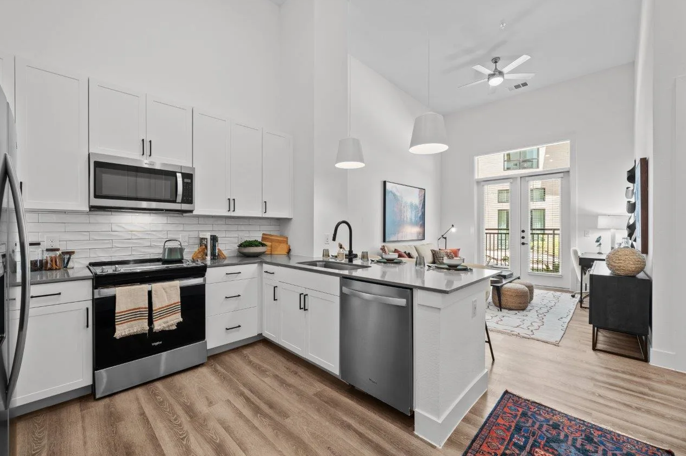
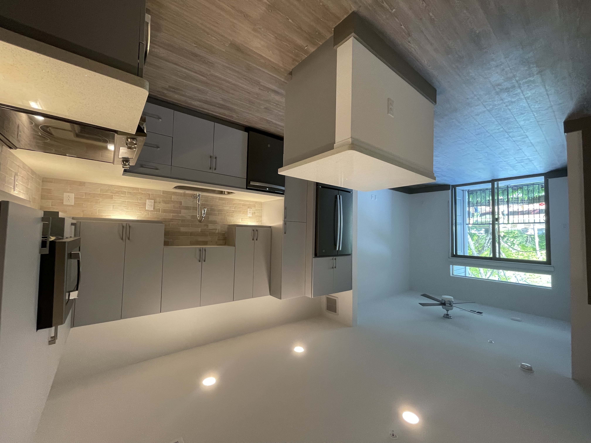
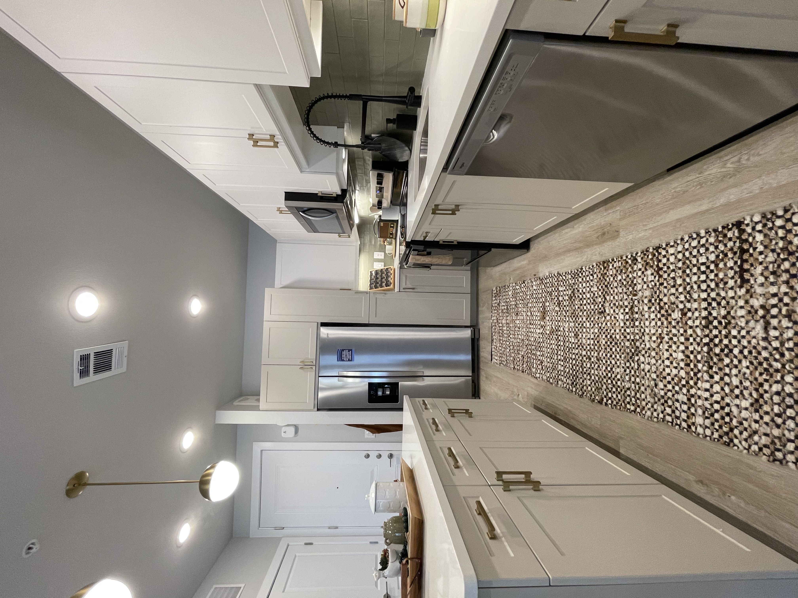

<!-- STICKY NAV -->
<nav>
  <a href="/" class="nav-brand">Apartment Deals Austin</a>
  <ul class="nav-links">
    <li><a href="#deals">Deals</a></li>
    <li><a href="#calculator">Calculator</a></li>
    <li><a href="#about">About</a></li>
    <li><a href="faq-blog.html">Blog</a></li>
  </ul>
  <a href="sms:9727547790" class="nav-cta">Text Me Now</a>
</nav>

<!-- ============================================================
     1. HERO
     ============================================================ -->
<header class="hero">
  
  <h1>Austin's Best Apartment Deals</h1>
  
I find Austin renters the best move-in specials in the city — weeks free, waived fees, gift cards. Completely free to you.

  

    <a href="sms:9727547790" class="btn btn-white">Text Me Now — It's Free</a>
    <a href="https://forms.gle/UaBbaEc6RfzK8iPS7" target="_blank" class="btn btn-ghost">Fill Out My Intake Form</a>
  

</header>

<!-- ============================================================
     2. HOW IT WORKS
     ============================================================ -->
<section class="section" id="how-it-works">
  

    

      <h2>How It Works</h2>
      
Three steps is all it takes. No fees, no catch — the property pays me when you sign.

    

    

      

        
1

        <h3>Tell me what you need</h3>
        
Text me your budget, move-in date, and the areas you're interested in. Takes about two minutes.

      

      

        
2

        <h3>I find the best deals</h3>
        
I dig through current specials across Austin — weeks free, waived deposits, gift cards — and hand-pick the best matches for you.

      

      

        
3

        <h3>You move in, you pay nothing</h3>
        
My service is 100% free to renters. The property pays my fee when you lease. You just get a great deal.

      

    

  

</section>

<!-- ============================================================
     3. CURRENT DEALS
     ============================================================ -->
<section class="section section-alt" id="deals">
  

    

      <h2>Deals of the Week</h2>
      
These specials move fast. Text me to find out what's still available — or to see what else I'm working with right now.

    

    

      

        

          
        

        

          
Central Austin

          
1 Bed &bull; $1,352/mo effective

          
Brand new build in one of Austin's most walkable neighborhoods. 8 weeks free + $500 gift card. Rooftop pools, gym, EV charging. Listed at $1,597 — effective rent after special is $1,352.

          <a href="sms:9727547790" class="btn btn-primary btn-sm">Text Me About This</a>
        

      

      

        

          
        

        

          
East Austin

          
1 Bed &bull; $1,316/mo effective

          
Backs up to a greenbelt with miles of trails. 10 weeks free. 12 minutes to downtown. Great access to the best food, coffee, and nightlife East Austin has to offer. Listed at $1,630.

          <a href="sms:9727547790" class="btn btn-primary btn-sm">Text Me About This</a>
        

      

      

        

          
        

        

          
South Austin

          
2 Bed / 2 Bath &bull; $1,620/mo effective

          
Brand new 2/2 in South Austin at a price that's hard to beat. 8 weeks free. Steps from a brand new H-E-B and all the South Austin classics. Listed at $1,920.

          <a href="sms:9727547790" class="btn btn-primary btn-sm">Text Me About This</a>
        

      

    

  

</section>

<!-- ============================================================
     4. RENT CALCULATOR
     ============================================================ -->
<section class="section" id="calculator">
  

    

      <h2>What's Your Effective Rent?</h2>
      
Move-in specials are quoted in weeks free — this calculator shows you what that means for your actual monthly payment.

    

    

      

        <form id="calculator-form">
          

            <label for="rent">Listed Monthly Rent ($)</label>
            <input type="number" id="rent" name="rent" placeholder="e.g. 1597" required>
          

          

            <label for="lease">Lease Term (months)</label>
            <input type="number" id="lease" name="lease" placeholder="e.g. 12" required>
          

          

            <label for="freeWeeks">Weeks Free</label>
            <input type="number" id="freeWeeks" name="freeWeeks" placeholder="e.g. 8" required>
          

          <button type="submit" class="btn btn-primary">Calculate My Effective Rent</button>
        </form>
        

      

      

        
Want deals like this? I'll find them for you.

        <a href="sms:9727547790" class="btn btn-primary">Text Me Now</a>
      

    

  

</section>

<!-- ============================================================
     5. WHY USE A LOCATOR
     ============================================================ -->
<section class="section section-alt" id="why">
  

    

      <h2>Why Use a Locator?</h2>
      
Most renters don't know this service exists — and the ones who use it move faster and pay less.

    

    

      

        
&#x1F4B0;

        <h3>It's 100% free to you</h3>
        
The property pays my fee when you sign a lease. You get expert help finding the best deal — at zero cost.

      

      

        
&#x26A1;

        <h3>Move faster</h3>
        
I already know which buildings have inventory, which ones are negotiating, and where the real specials are right now. No wasted tours.

      

      

        
&#x1F3D9;

        <h3>Real local knowledge</h3>
        
I'm in Austin full time. I know which neighborhoods fit which lifestyles and which new builds are actually worth it.

      

      

        
&#x1F91D;

        <h3>A real person, not an algorithm</h3>
        
I respond fast, I'm honest about what I see, and I'll tell you if a deal isn't right for you. That's not something a listing site does.

      

    

  

</section>

<!-- ============================================================
     6. ABOUT TAYLOR
     ============================================================ -->
<section class="section" id="about">
  

    

      
      

        <h2>About Me</h2>
        
I'm Taylor — a licensed real estate agent based in Austin, TX. I work exclusively as an apartment locator, which means my full-time focus is knowing where the best deals are in this city and matching renters with them fast.

        
I cover Austin and the surrounding areas: Cedar Park, Leander, Round Rock, and Pflugerville. I respond quickly, I'm straight with you about what I see, and I genuinely enjoy helping people find a great place to live.

        
The service is completely free to you. Text me and let's get started.

        <a href="sms:9727547790" class="btn btn-primary">Text Taylor &mdash; (972) 754-7790</a>
      

    

  

</section>

<!-- ============================================================
     7. TESTIMONIALS
     ============================================================ -->
<section class="section section-alt" id="testimonials">
  

    

      <h2>What Clients Say</h2>
    

    <!-- TODO: Replace placeholder quotes with real client testimonials -->
    

      

        
"Taylor found me a place with 6 weeks free that I never would have found on my own. Saved me over $1,000 and the whole process took less than a week."

        
— Austin renter, East Austin

      

      

        
"I was completely overwhelmed searching on my own. Taylor narrowed it down to three options that actually fit my budget and lifestyle. Moved in two weeks later."

        
— Austin renter, South Austin

      

      

        
"Didn't know this was a free service until a friend told me. Wish I had found Taylor two apartments ago. 10/10 would recommend to anyone moving to Austin."

        
— Austin renter, Cedar Park

      

    

    

      
    

  

</section>

<!-- ============================================================
     8. FINAL CTA
     ============================================================ -->
<section class="final-cta" id="contact">
  <h2>Ready to find your place in Austin?</h2>
  
Text me now and I'll send you a curated list of the best deals available today — no forms, no waiting, no cost.

  

    <a href="sms:9727547790" class="btn btn-white">Text Me Now &mdash; (972) 754-7790</a>
    <a href="https://forms.gle/UaBbaEc6RfzK8iPS7" target="_blank" class="btn btn-ghost">Fill Out the Intake Form</a>
  

</section>

<!-- ============================================================
     9. FOOTER
     ============================================================ -->
<footer>
  

    

      
<strong style="color:rgba(255,255,255,0.9)">Taylor Boykin</strong> &mdash; Austin Apartment Locator

      

        <a href="sms:9727547790">(972) 754-7790</a>
        &nbsp;&bull;&nbsp;
        <a href="mailto:taylor@myapartmentfinders.com">taylor@myapartmentfinders.com</a>
      

    

    <ul class="footer-nav">
      <li><a href="/">Home</a></li>
      <li><a href="#deals">Deals</a></li>
      <li><a href="#calculator">Calculator</a></li>
      <li><a href="faq-blog.html">Blog</a></li>
      <li><a href="#contact">Contact</a></li>
    </ul>
    

      
&copy; 2026 Apartment Deals Austin &mdash; Taylor Boykin, Licensed Real Estate Agent, Texas

      

        <a href="https://acrobat.adobe.com/id/urn%3Aaaid%3Asc%3AUS%3A22ee4d14-818b-4513-9cae-d4d11f140285/?x_api_client_id=acom_nav&filetype=application%2Fpdf"
           target="_blank"
           rel="noopener noreferrer">
          Texas Real Estate Commission Information About Brokerage Services
        </a>
      

    

  

</footer>
